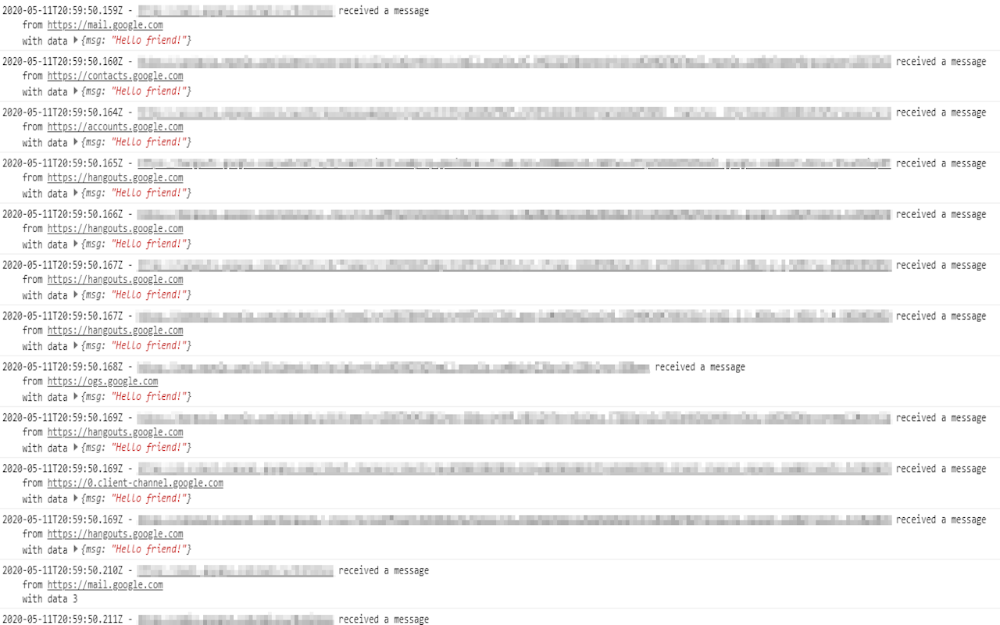

# PostMessage log & debug extension

PostMessage log & debug is an open source extension that allows you to view all messages on your browser console. It allows you to send a custom message to test your webpage message listener

## License

MIT License (MIT)

## Contributing

If you find a bug or think about enhancement, feel free to contribute and submit an issue or a pull request.